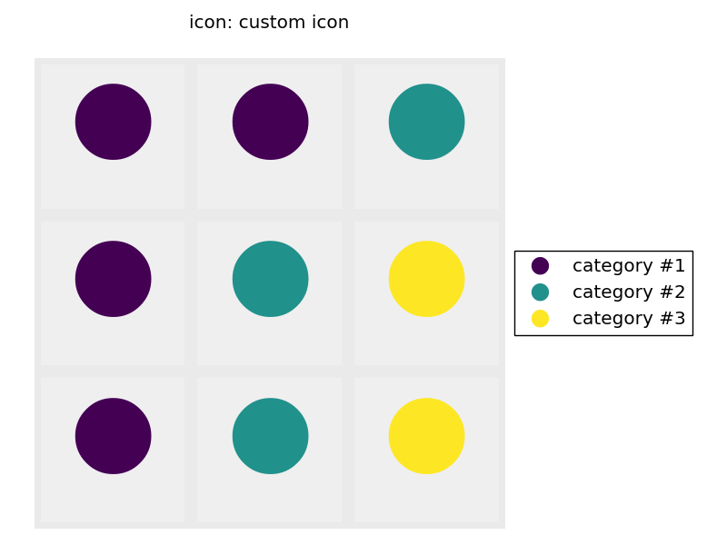

===========
Wafflemaker
===========

.. image:: https://img.shields.io/pypi/v/wafflemaker.svg
        :target: https://pypi.python.org/pypi/wafflemaker

A python package to generate waffle plots.

Installation
============

To install the latest stable version, run this command in your terminal:

.. code-block:: console

    pip install -U wafflemaker

To install the development version:

.. code-block:: console

    git clone https://github.com/shapiromatron/wafflemaker
    cd wafflemaker
    pip install -e .
    pip install -e .[test]

To run tests:

.. code-block:: console

    cd wafflemaker
    py.test

Image comparisons from matplotlib use the `pytest-mpl`_ library. To
create new baseline images for comparison:

.. code-block:: console

    py.test --mpl-generate-path=tests/baseline

Please submit tests with new feature requests.

.. _`pytest-mpl`: https://pypi.python.org/pypi/pytest-mpl

.. include:: HISTORY.rst
