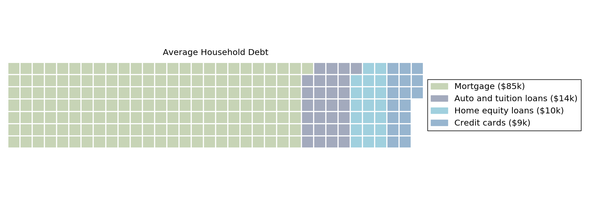

===========
Wafflemaker
===========

.. image:: https://img.shields.io/pypi/v/wafflemaker.svg
        :target: https://pypi.python.org/pypi/wafflemaker

A python package to generate waffle plots.

Code used to generate this example, based on examples from the excellent R-based
`waffle`_ library:

.. _`waffle`: https://github.com/hrbrmstr/waffle

.. code-block:: python

    import pandas as pd
    import wafflemaker

    df = pd.DataFrame(dict(
        values=[84911, 14414, 10062, 8565],
        categories=[
            'Mortgage ($85k)',
            'Auto and tuition loans ($14k)',
            'Home equity loans ($10k)',
            'Credit cards ($9k)'
        ],
        hues=["#c7d4b6", "#a3aabd", "#a0d0de", "#97b5cf"]
    ))

    df['scaled_values'] = df['values'] / 500.

    wafflemaker.waffle(
        nrows=7,
        scale_to_dims=False,

        data=df,
        values='scaled_values',
        labels='categories',
        hue='hues',

        title='Average Household Debt',
        grid_options=dict(linewidth=2),
        figure_options=dict(figsize=(14, 5)),
    )

For more examples, see the `jupyter notebook`_.

.. _`jupyter notebook`: https://github.com/shapiromatron/wafflemaker/blob/master/notebooks/Examples.ipynb

Installation
============

To install the latest stable version, run this command in your terminal:

.. code-block:: bash

    pip install -U wafflemaker

Development
===========

To install the development version:

.. code-block:: bash

    git clone https://github.com/shapiromatron/wafflemaker
    cd wafflemaker
    pip install -e .
    pip install -e .[test]

To run tests:

.. code-block:: bash

    cd wafflemaker
    py.test

Image comparisons from matplotlib use the `pytest-mpl`_ library. To
create new baseline images for comparison:

.. code-block:: bash

    py.test --mpl-generate-path=tests/baseline

Please submit tests with new feature requests.

.. _`pytest-mpl`: https://pypi.python.org/pypi/pytest-mpl

.. include:: HISTORY.rst
